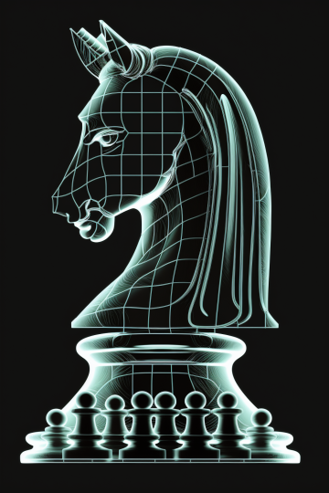

  <h1 align="center">Chess Thinker</h1>
  

  <h2 align="center">Chess Board Reconstrauction</h2>
  
  

Introducing Chess Thinker, a revolutionary app that brings 3D technology to the traditional 2D chess board and pieces reconstruction. Chess players now have the ability to easily evaluate chess positions and get the correct evaluation and best lines.With Chess Thinker, you can capture an image of the chess position and receive immediate feedback on the best lines.
  
 As a chess player, accurately evaluating a position on a physical board can be a time-consuming and mentally demanding task. But with the help of the "Chess Thinker" App, this process is simplified and can be done in just a matter of seconds

Playing a friendly chess match is a great way to improve your skills and track your progress. However, it can be difficult to identify mistakes and evaluate the positions during the game. But with the "Chess Thinker" App, you can easily capture an image of the board and analyze the positions of the game to see what you missed. This makes it simple to identify areas for improvement and track your progress.
  
 With the "Chess Thinker" App, you no longer need to invest in a costly eboard. You can now use your mobile device to analyze your games, making it more accessible and affordable for chess players of all levels.

We are pleased to announce the successful test run of our innovative "Chess Thinker" App.Our app uses cutting-edge machine learning algorithms to analyze chess positions based on images.We are continuously working on generalizing our models and developing our user interface to make it even more user-friendly.

Currently, our app only supports image analysis, but we have big plans for the future.We plan to introduce real-time evaluation system with an automatic recording system.

We are passionate about revolutionizing the way chess players analyze their games and improve their skills.With "Chess Thinker" App, we are one step closer to making this vision a reality.

     
  

##  Methodology

### 1: Keypoint Detection Algorithm

This algorithm is built on top of the ResNet architecture, which is a robust and powerful architecture known for its ability to learn complex representations of visual data. 
The keypoint detection algorithm utilizes the features learned by the ResNet architecture to accurately 
detect the corners of the board, making it an effective solution for this task.

### 2: Warp Perspective Transformation 

### 3: Train Chess Peace Detection Model
#### YOLOv8

### 4: Find Positions of Pieces

