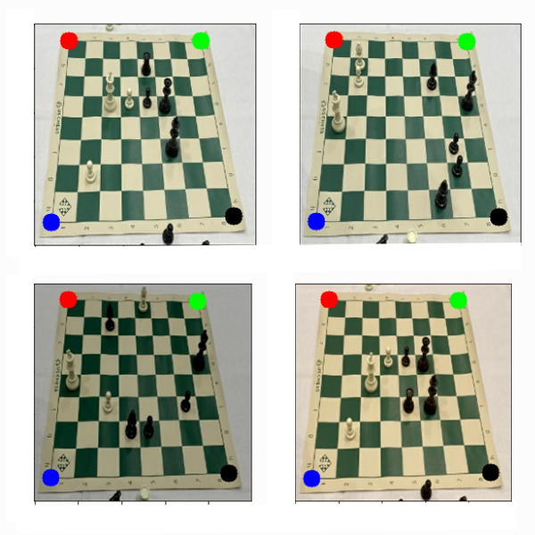
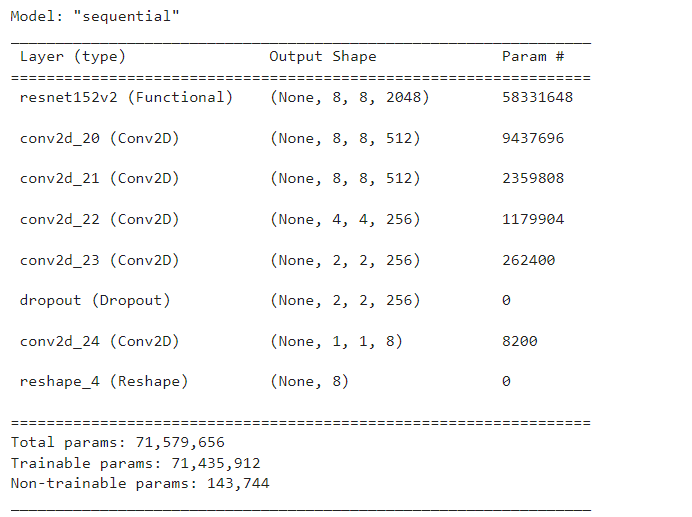
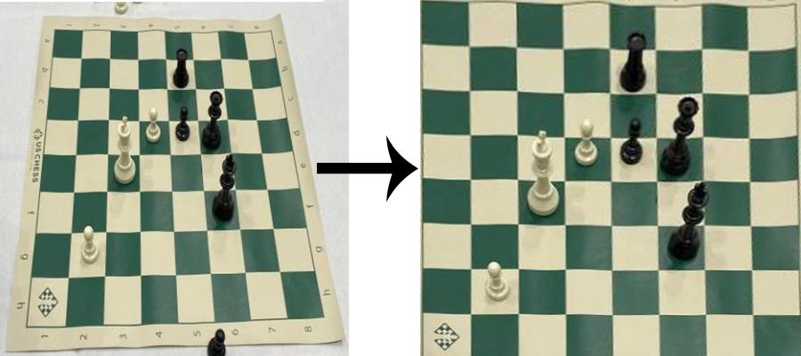
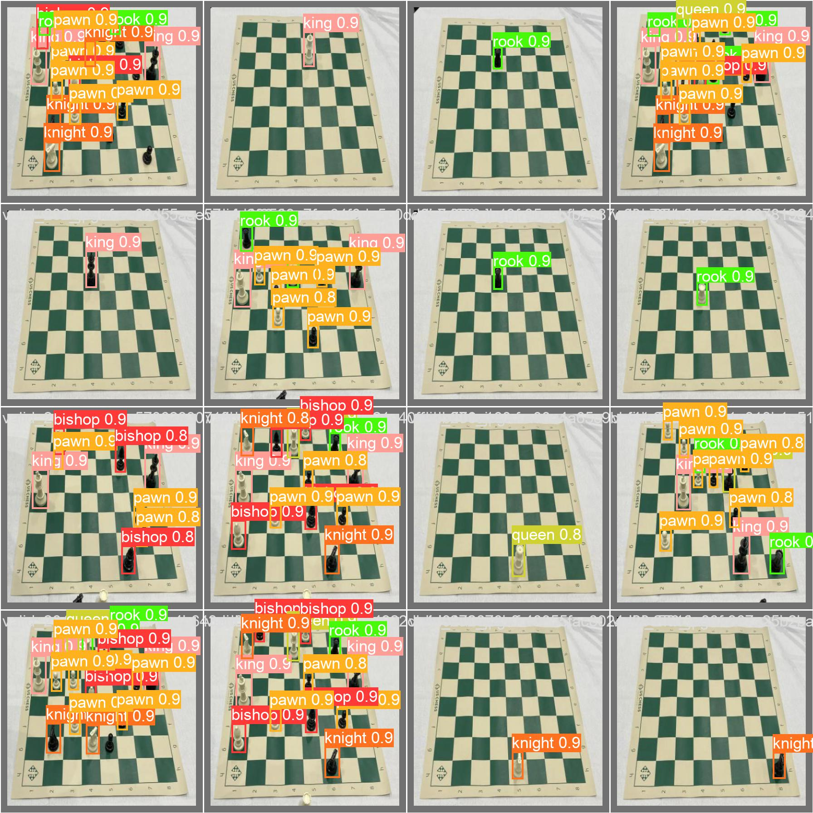
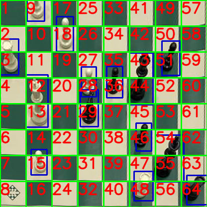

  <h1 align="center">Chess Board Reconstrauction</h3>

  

    Using Computer-Vision
     
  

##  Chessborad Corners Detection

### 1: Keypoint Detection Algorithm

This algorithm is built on top of the ResNet architecture, which is a robust and powerful architecture known for its ability to learn complex representations of visual data. 
The keypoint detection algorithm utilizes the features learned by the ResNet architecture to accurately 
detect the corners of the board, making it an effective solution for this task.

### 2: Warp Perspective Transformation 

### 3: Train Chess Peace Detection Model
#### YOLOv8

### 4: Find Positions of Pieces

